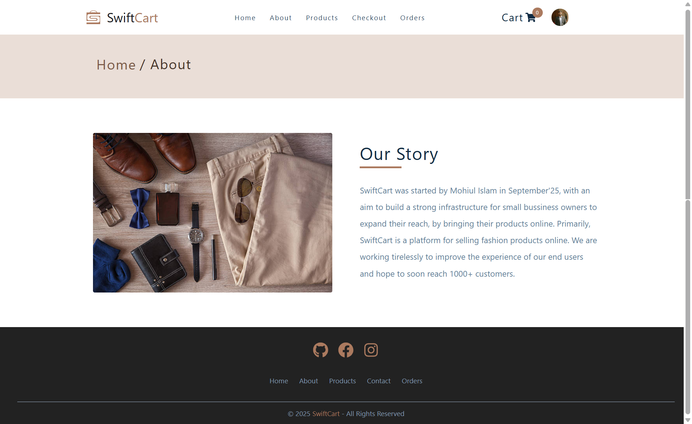
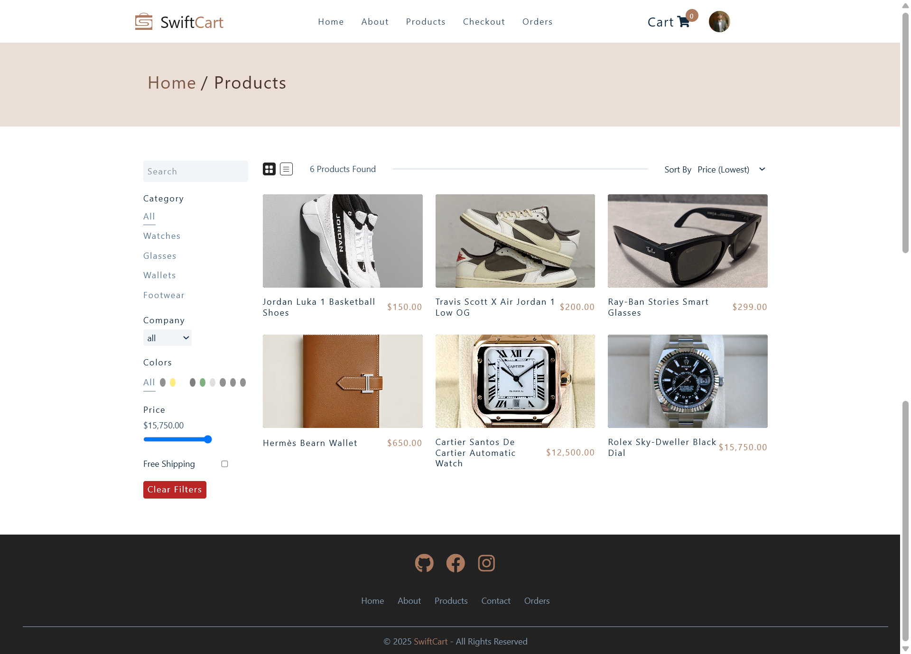
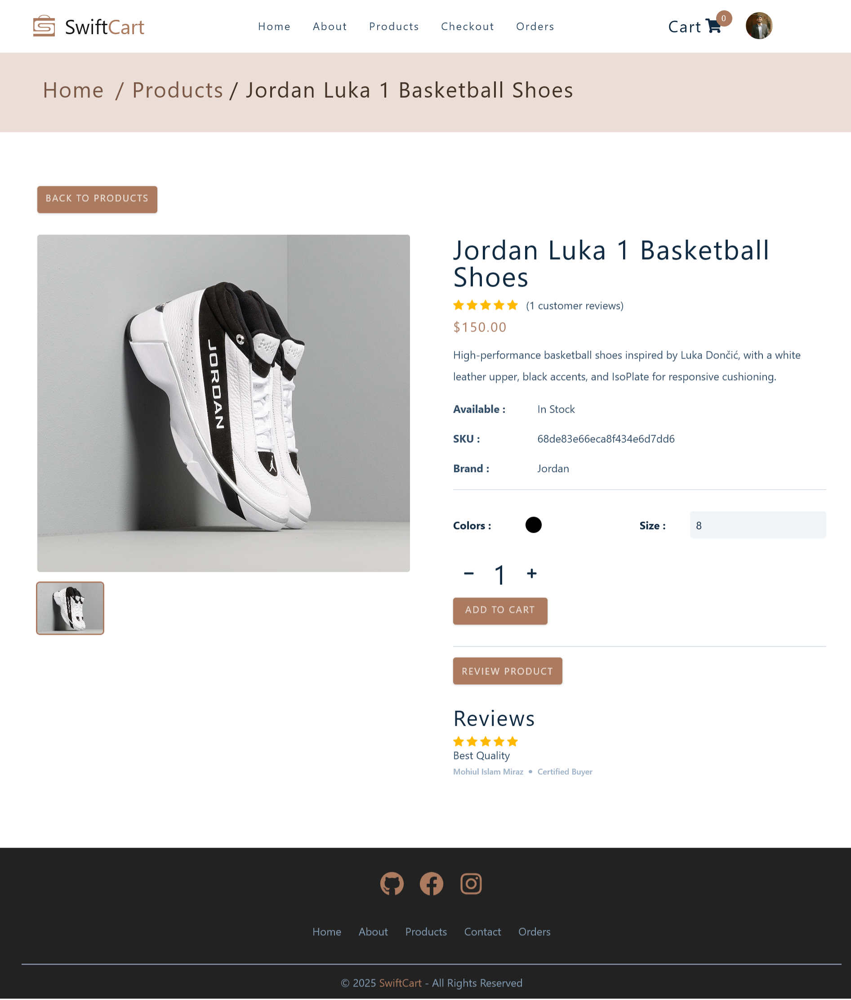
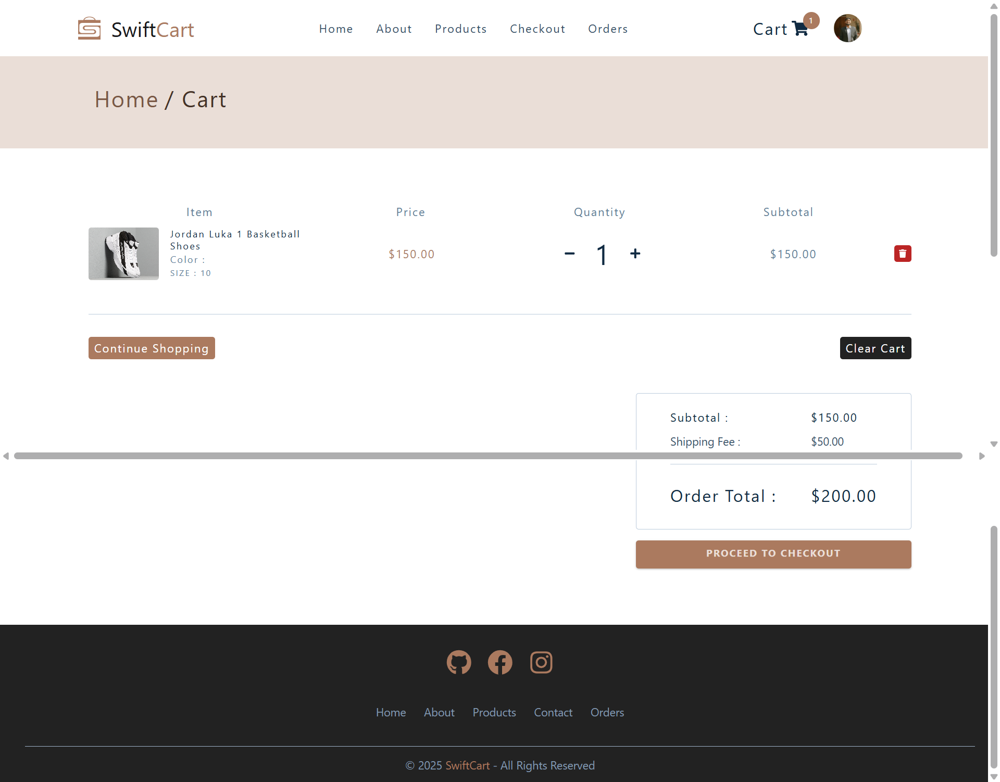
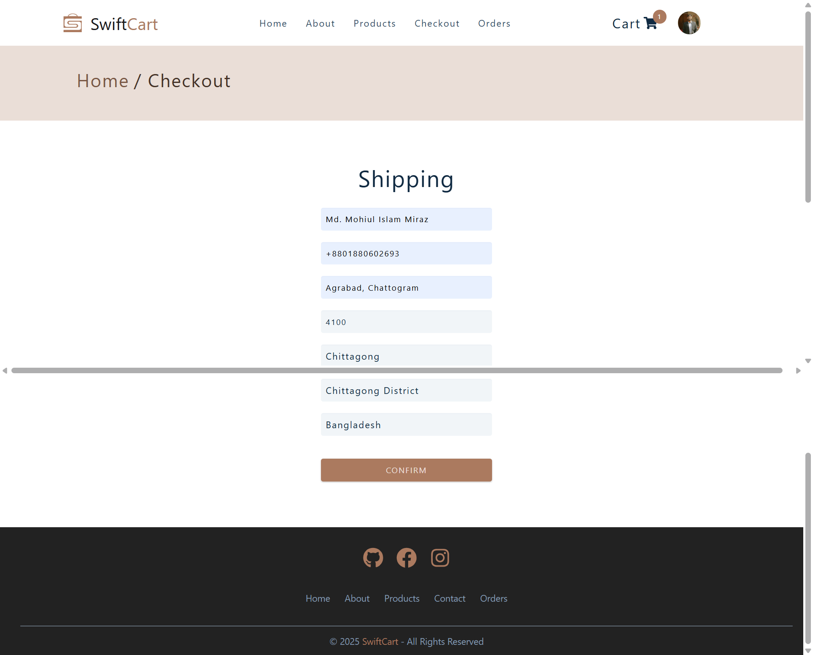
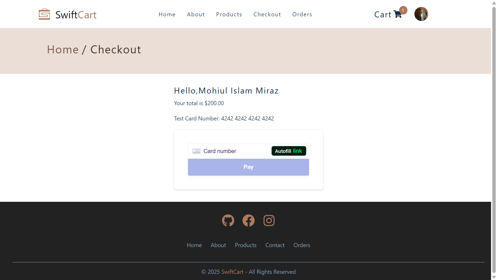
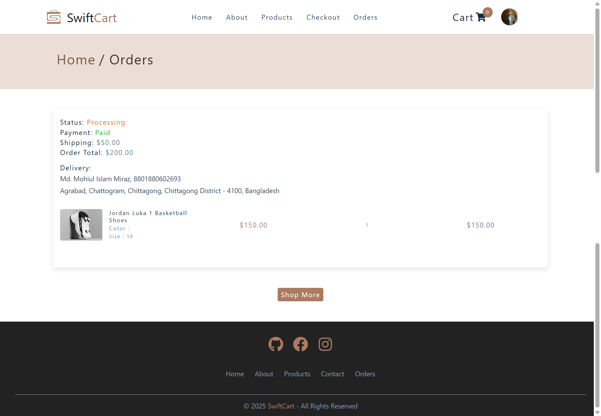

# 🛒 Swift Cart - Fashion E-commerce Platform

A modern, full-stack e-commerce platform built with Mern, featuring a complete shopping experience with user authentication, product management, cart functionality, and secure payment processing.

## 🚀 Live Demo

**Frontend:** [swiftcartbd.vercel.app](https://swiftcartbd.vercel.app/)

## 📱 Features

- **User Authentication** - Secure login/register system
- **Product Catalog** - Browse and search products with filtering
- **Shopping Cart** - Add/remove items with quantity management
- **Secure Checkout** - Stripe payment integration
- **Order Management** - Track order history and status
- **Admin Dashboard** - Complete admin panel for product and order management
- **Responsive Design** - Mobile-first approach

## 🖼️ Screenshots

### Landing Page

*Welcome to Swift Cart - Your one-stop shopping destination*

### About Page

*Learn more about our company and mission*

### User Registration

*Create your account to start shopping*

### User Login

*Sign in to your account*

**Test Credentials:**
- **Email:** testuser@gmail.com
- **Password:** Testuser@2025

### User Profile

*Manage your account information and preferences*

### Products Page

*Browse our extensive product catalog with filtering options*

### Product Quick View

*Quick preview of product details without leaving the page*

### Shopping Cart

*Review your selected items before checkout*

### Checkout Process

*Secure checkout with shipping information*

### Stripe Payment

*Secure payment processing powered by Stripe*

### Orders Page

*Track your order history and status*

## 🛠️ Tech Stack

### Frontend
- **React** - UI library
- **Vite** - Build tool
- **React Router** - Client-side routing
- **Context API** - State management
- **Styled Components** - CSS-in-JS styling and Tailwind
- **Axios** - HTTP client

### Backend
- **Node.js** - Runtime environment
- **Express.js** - Web framework
- **MongoDB** - Database
- **JWT** - Authentication
- **Stripe** - Payment processing

### Deployment
- **Vercel** - Frontend hosting
- **Vercel** - Backend hosting

## 🚀 Getting Started

### Prerequisites
- Node.js (v14 or higher)
- npm or yarn
- MongoDB Atlas account (for database)

### Installation

1. **Clone the repository**
   ```bash
   git clone https://github.com/miraz23/Swiftcart_client.git
   cd Swiftcart_client
   ```

2. **Install dependencies**
   ```bash
   npm install
   ```

3. **Environment Setup**
   Create a `.env` file in the root directory:
   ```env
   VITE_API_URL=your_backend_url
   VITE_STRIPE_PUBLISHABLE_KEY=your_stripe_key
   ```

4. **Start the development server**
   ```bash
   npm run dev
   ```

5. **Open your browser**
   Navigate to `http://localhost:5173`

## 📁 Project Structure

```
src/
├── components/          # Reusable UI components
├── pages/              # Page components
├── contexts/           # React contexts for state management
├── hooks/              # Custom React hooks
├── actions/            # Action creators
├── reducers/           # State reducers
├── constants/          # Application constants
├── service/            # API services
└── assets/             # Static assets
```

## 🔐 Authentication

The application includes a complete authentication system with:
- User registration and login
- Password reset functionality
- Protected routes
- Role-based access control (User/Admin)

## 💳 Payment Integration

Secure payment processing using Stripe:
- Credit/Debit card payments
- Secure tokenization
- Payment confirmation
- Order tracking

## 🎨 Design Features

- **Responsive Design** - Works on all devices
- **Modern UI/UX** - Clean and intuitive interface
- **Dark/Light Theme** - User preference support
- **Loading States** - Smooth user experience
- **Error Handling** - Graceful error management

## 🔗 Related Projects

### Admin Dashboard
- **Repository:** [Swiftcart Admin](https://github.com/miraz23/Swiftcart_admin)
- **Live Demo:** [swiftcartbd-admin.vercel.app](https://swiftcartbd-admin.vercel.app/)

### Backend API
- **Repository:** [Swiftcart Server](https://github.com/miraz23/Swiftcart_server)
- **Live Demo:** [swiftcartbd-server.vercel.app](https://swiftcartbd-server.vercel.app/)

## 🤝 Contributing

1. Fork the repository
2. Create your feature branch (`git checkout -b feature/AmazingFeature`)
3. Commit your changes (`git commit -m 'Add some AmazingFeature'`)
4. Push to the branch (`git push origin feature/AmazingFeature`)
5. Open a Pull Request

## 📝 License

This project is licensed under the MIT License - see the [LICENSE](LICENSE) file for details.

## 👨‍💻 Author

**Md. Mohiul Islam Miraz**
- GitHub: [@miraz23](https://github.com/miraz23)

## 🙏 Acknowledgments

- Stripe for payment processing
- Vercel for hosting
- React community for excellent documentation
- All contributors who helped make this project possible

---

⭐ **Star this repository if you found it helpful!**
